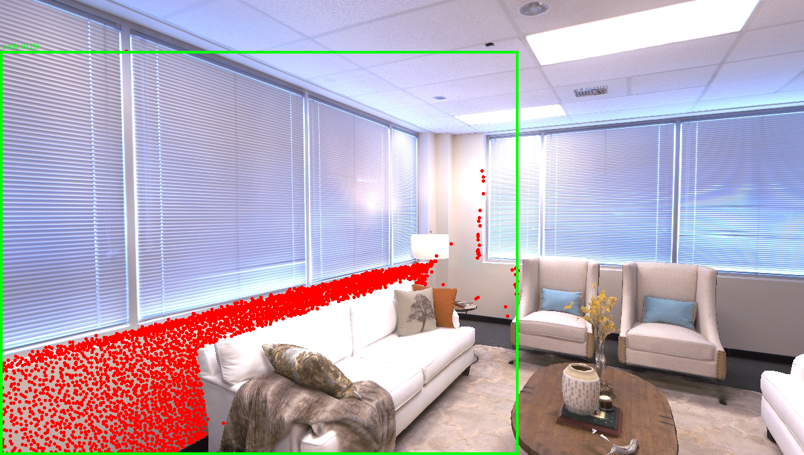

# SplatQuery — talk to a 3D scene

**Open-vocabulary, language-grounded 3D scene understanding.** Reconstruct a room from posed RGB-D, then ask for things in plain English — *"go to the lamp"*, *"what is near the sofa?"* — and SplatQuery finds the object in 3D and returns either a robot navigation goal or a spatial answer. Open-vocabulary (no fixed label list), and it runs **fully local** on a single consumer GPU — no cloud, no API keys.



*The query `"a sofa"` grounded back onto the real frames: the matched 3D object's points (red) projected onto the sofa it was retrieved from. No object labels were used anywhere in the pipeline — the match comes purely from CLIP image/text similarity over a 3D object map.*

---

## What it does

Given a stream of posed RGB-D frames, SplatQuery builds a queryable **3D semantic object map**, then grounds natural-language instructions against it:

```
posed RGB-D ─▶ SAM2 masks ─▶ CLIP region embeddings ─▶ lift to 3D
            ─▶ fuse detections into object nodes (the semantic map)
            ─▶ LLM grounding agent (instruction → intent + target)
            ─▶ CLIP retrieval over the map
            ─▶ navigation goal pose   /   spatial Q&A
```

The grounding agent runs on a **local LLM** (Qwen2.5 via Ollama): it classifies the instruction (navigate vs. ask), expands the target into CLIP-friendly phrases, and — for questions — composes a spatial answer from the retrieved objects' 3D positions.

## It works (real output, local LLM)

Navigation — *"go to the lamp"* resolves to a 3D object and a standoff goal pose:

```
intent=navigate  target="lamp"  phrases=['lamp','table lamp','floor lamp','reading lamp','desk lamp','light']
NAV GOAL -> object 6 (match 0.29)
  stand at: (3.02, -0.73, -0.17) m
  face yaw: -171.1 deg, standoff 0.80 m
```

Spatial Q&A — *"what is near the sofa?"* is routed to a question and answered, not driven to:

```
intent=ask  target="sofa"
ANSWER: The sofa is near a large object at (6.16, 2.55, -1.45) ...
```

The intent split (navigate vs. ask) is decided by the LLM, so the same interface handles both commands and questions.

## How it's built

| Stage | What runs | Where |
|---|---|---|
| Perception | SAM2 open-vocabulary masks + CLIP region embeddings | `splatquery/perception/` |
| Lifting | back-project masked regions to 3D via depth + pose | `splatquery/mapping/lifting.py` |
| Fusion | cluster + floor-aware union-find merge into objects | `splatquery/mapping/semantic_map.py` |
| Grounding | dual LLM backend (local Qwen / Claude) + retrieval | `splatquery/agent/` |
| Output | grounded object → navigation goal pose | `splatquery/robotics/navigation.py` |

A key design choice is **detection caching**: the expensive perception pass (SAM2 + CLIP, minutes) is saved to disk, so the cheap fusion step can be re-tuned and the map rebuilt in seconds (`scripts/03_refuse.py`).

## Quickstart

Built and tested on Ubuntu 22.04 (WSL2) + RTX 4070, CUDA 12.1.

```bash
# 1. perception environment
conda create -n splatquery python=3.10 -y && conda activate splatquery
pip install torch torchvision --index-url https://download.pytorch.org/whl/cu121
pip install -r requirements.txt
pip install "git+https://github.com/facebookresearch/sam2.git"

# 2. SAM2 checkpoint
mkdir -p checkpoints && wget -P checkpoints \
  https://dl.fbaipublicfiles.com/segment_anything_2/092824/sam2.1_hiera_small.pt

# 3. local LLM (free, no API key)
curl -fsSL https://ollama.com/install.sh | sh && ollama pull qwen2.5:7b
```

Then, on a posed RGB-D scene (e.g. a Replica room in `data/Replica/room0`):

```bash
# build the map once (caches detections for fast re-fusion)
python scripts/01_build_map.py --set dataset.root=data/Replica/room0 --out runs/room0/map.pkl

# ask it things, fully local
python scripts/02_query.py --map runs/room0/map.pkl \
  --set agent.backend=local agent.local_model=qwen2.5:7b --ask "go to the lamp"

# re-tune fusion in seconds without re-running SAM2
python scripts/03_refuse.py --cache runs/room0/detections.pkl --out runs/room0/map.pkl \
  --set mapping.merge_overlap_threshold=0.2

# verify a query by projecting the matched object onto the frames (headless)
python viz/verify_query.py --map runs/room0/map.pkl --ask "a sofa" \
  --set dataset.root=data/Replica/room0
```

Switch to the cloud backend with `--set agent.backend=claude` (needs `ANTHROPIC_API_KEY`); the rest is identical.

## Design notes & limitations

- **Open-vocabulary by construction.** SAM2 proposes class-agnostic masks; meaning comes only from CLIP. There is no fixed label set anywhere — you can query for things the system was never told about.
- **Floor-aware fusion.** Room-scale flat surfaces (floor, walls, rug) have huge bounding boxes that would otherwise swallow every object during merging. The fusion step detects and excludes these, and merges object fragments only when geometry *and* appearance agree.
- **Honest edge case.** Bounding-box fusion struggles with adjacent same-colored regions (a white sofa beside white window blinds can over-merge). This is a known ceiling of box-based fusion; a trained per-Gaussian language field (LangSplat-style) would resolve it and is a natural future upgrade.
- **Local-LLM spatial answers** are serviceable but limited by the 7B model; navigation grounding is the strongest path.

## Roadmap

- **Project 2 — language-grounded manipulation.** Use SplatQuery as the perception/grounding front-end for a robot arm: ground an instruction to a target object, synthesize a grasp, and execute it with MoveIt2 in simulation. (The ROS2 + Gazebo stack is the next build.)
- **Language-embedded Gaussian field.** Replace the discrete object map with a trained continuous CLIP-feature field for crisper, label-free retrieval.

---

Built by Shiva Kumar Dhandapani. Perception (SAM2, CLIP, 3D lifting) + a local LLM grounding agent, validated on real RGB-D data.
